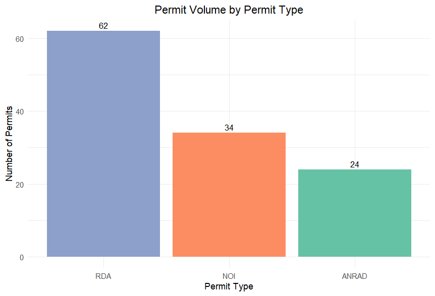
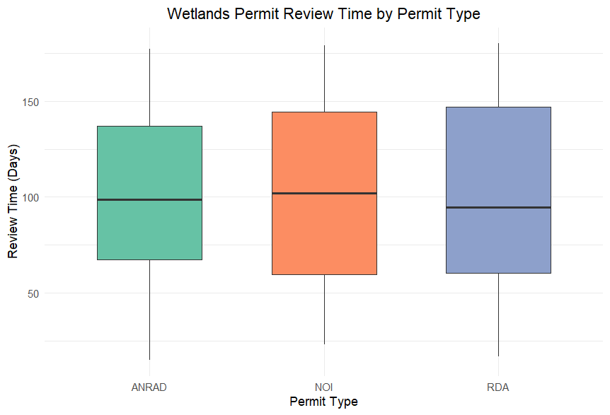

# Municipal Wetlands Permit Review Analysis

An exploratory environmental data analysis using **R and tidyverse** to examine municipal wetlands permit activity, review timelines, and workload patterns.

## Project Overview

This project uses a simulated dataset of 120 municipal wetlands permit records to explore patterns in permit volume and review duration across different permit types.

The analysis demonstrates how municipal environmental data can be organized, analyzed, and visualized to support evidence-based review and decision-making.

## Research Questions

- What types of wetlands permits make up the largest share of municipal review activity?
- How do review timelines vary among permit types?
- Which permit categories show the greatest variability in review duration?
- What patterns could help inform workload planning and permit review processes?

## Tools & Skills

**R • RStudio • tidyverse • Data Wrangling • Descriptive Statistics • Data Visualization • Environmental Data Analysis**

---

## Permit Volume Analysis

Requests for Determination of Applicability (RDAs) represented the largest share of simulated permit activity, followed by Notices of Intent (NOIs) and ANRAD applications.

### Permit Volume Summary

---

## Review Time Analysis

NOI applications showed somewhat longer average review times, while RDA review times displayed greater variability.

### Review Time Summary

---

## Key Findings

- RDAs represented the largest share of simulated permit activity.
- NOI applications had somewhat longer average review times.
- RDA review times showed greater variability.
- Longer individual review periods may reflect case-specific factors rather than permit type alone.

## Repository Contents

- [`wetlands_permits.R`](wetlands_permits.R) — R code used for data analysis and visualization
- [`figures/`](figures/) — project visualizations
- [`outputs/`](outputs/) — analytical summary tables
- [`report/`](report/) — completed project report
- [`wetlands_permit_analysis.Rproj`](wetlands_permit_analysis.Rproj) — RStudio project file

## Future Development

Future analysis could incorporate additional explanatory variables and statistical methods to investigate factors associated with permit review duration.

Potential extensions include regression analysis, statistical testing, and predictive modeling of review timelines.

---

## Data Note

This project uses a **simulated dataset created for portfolio and analytical practice**. It does not contain records from an actual municipality.

## Author

**Alyssa Pacheco**

Environmental Scientist | Coastal & Marine Science | GIS & Environmental Data Analysis
